# 💎 Jewellery React Native App

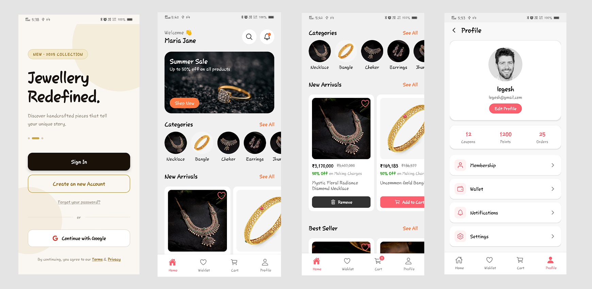

A modern **Jewellery Shopping Mobile Application** built using **React Native** and **Firebase Authentication**.
The app allows users to browse jewellery products, view details, add items to wishlist and cart, and manage their profile.

---

# 🚀 Features

- 🔐 Firebase Authentication (Email & Password)
- 🔑 Google Login
- 🏠 Home Page with featured products
- 📦 Product Listing
- 🔍 Product Details
- ❤️ Wishlist functionality
- 🛒 Cart management
- 👤 User Profile
- 📱 Clean modern UI

---

# 🛠 Tech Stack

- React Native
- Redux Toolkit
- Firebase Authentication
- React Navigation
- React Native Vector Icons

---

# 📱 App Screenshots

## Welcome / Authentication

| Welcome                      | Sign In                     | Sign Up                     |
| ---------------------------- | --------------------------- | --------------------------- |
| 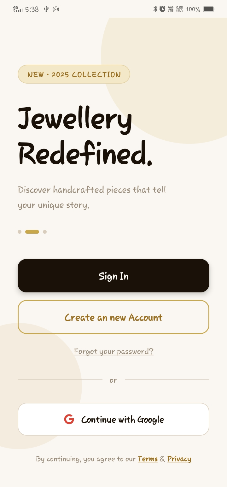 | 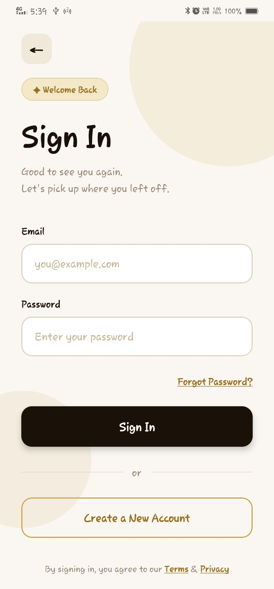 | 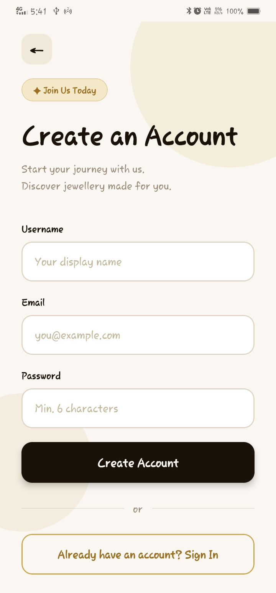 |

---

## Home

| Home Page                     | Home Listing                          |
| ----------------------------- | ------------------------------------- |
| 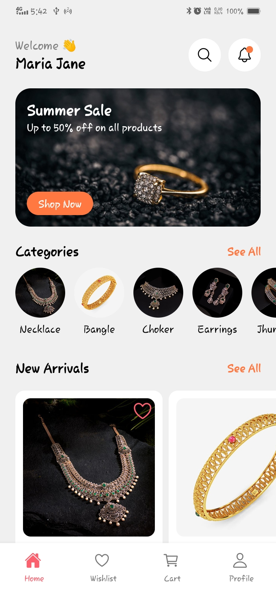 | 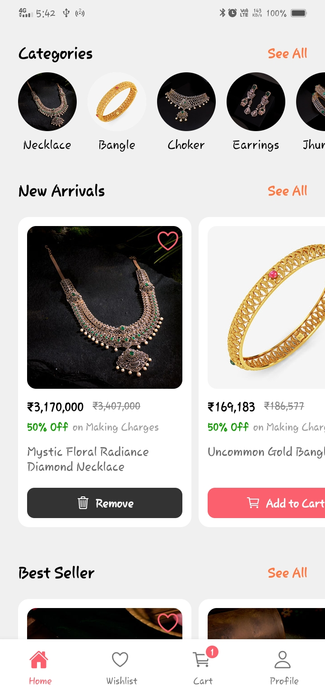 |

---

## Products

| Product Listing                      | Product Details                      |
| ------------------------------------ | ------------------------------------ |
| 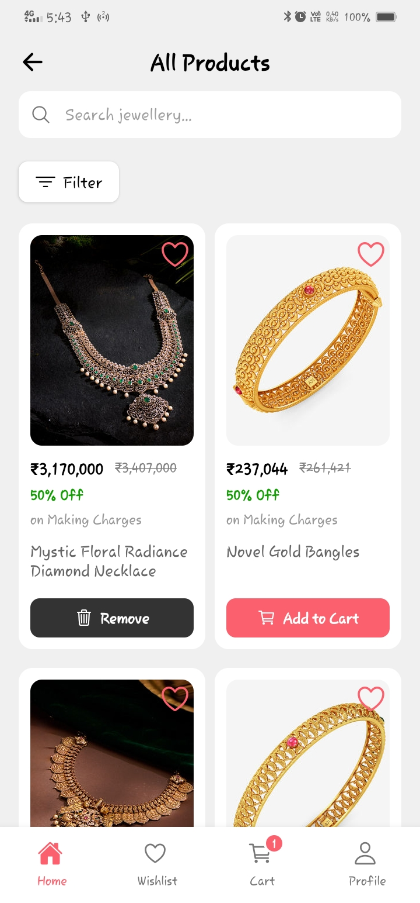 | 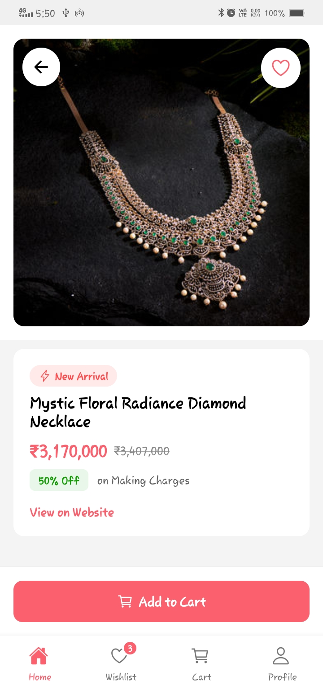 |

---

## User Features

| Wishlist                       | Cart                      | Profile                      |
| ------------------------------ | ------------------------- | ---------------------------- |
| 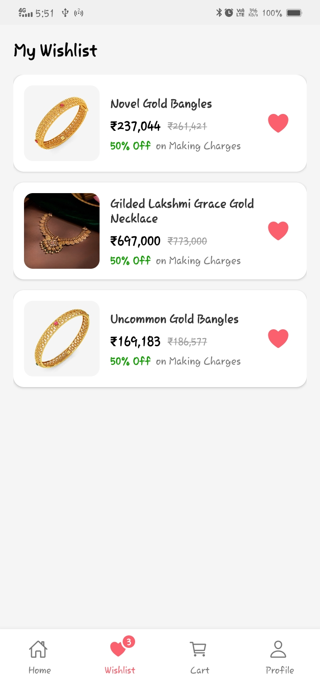 | 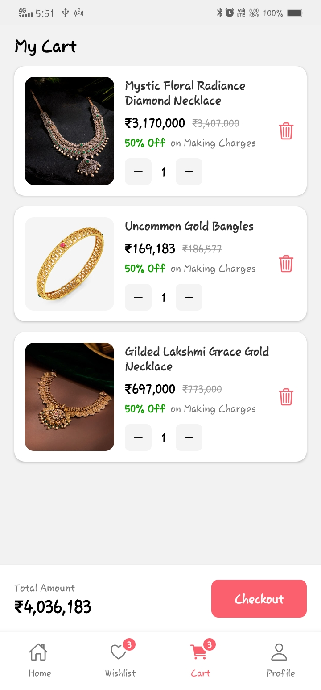 | 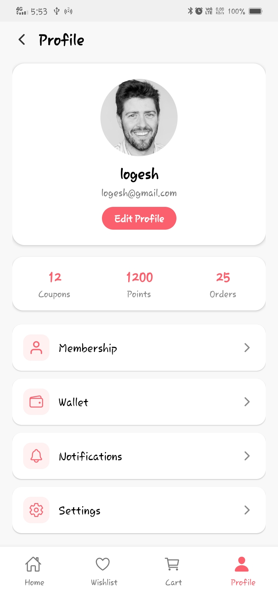 |

---

# ⚙️ Installation

Clone the repository

```
git clone https://github.com/yourusername/jewellery-app.git
```

Navigate to project folder

```
cd jewellery-app
```

Install dependencies

```
npm install
```

Run the application

```
npx react-native run-android
```

---

# 📂 Project Structure

```
src/
components/
screens/
redux/
contexts/
auth/

screenshots/
Welcome.jpg
SignIn.jpg
SignUp.jpg
HomePage.jpg
HomePage_Listing.jpg
Product_Listing.jpg
Product_Details.jpg
Wishlists.jpg
Cart.jpg
Profile.jpg
```

---

# 👨‍💻 Author

**Logesh**
React Native Developer
